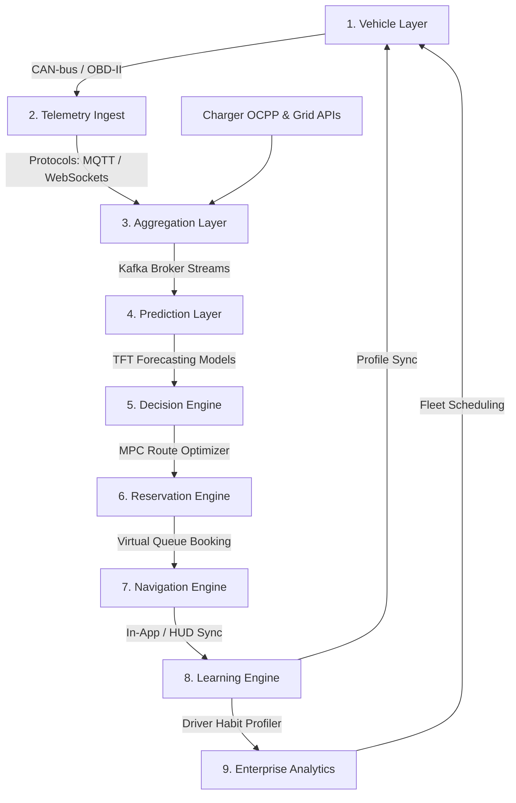

# EVIQ AI — Platform Architecture Specification

This document details the system architecture, data models, and engineering pipelines of **EVIQ AI** — the world's AI Operating System for EV Mobility Intelligence.

EVIQ AI is built as a highly distributed, decoupled platform of modular intelligence engines. Instead of a monolithic navigation app, EVIQ AI serves as an orchestration layer sitting above charging networks, vehicle battery systems, and enterprise fleet managers.

---

## 1. End-to-End Decision Pipeline

EVIQ AI operates around a continuous, nine-stage decision intelligence pipeline:



### Ingestion & Stream Processing

1. **Vehicle Layer (Battery & Telemetry Source)**: EV battery management systems (BMS) stream real-time voltage, current draw, cell temperatures, state of charge (SoC), and odometer metrics.
2. **Telemetry Ingest Layer**: Secure edge gateway clients and OEM webhook handlers read raw telemetry feeds. Data is signed and pushed over TLS 1.3 tunnels to cloud listeners.
3. **Aggregation Layer**: Combines active vehicle telemetry with third-party APIs:
   - **Charger Status**: Live occupancy, dynamic pricing tariffs, connector compatibility.
   - **Contextual APIs**: Real-time traffic congestion index, weather conditions, topographic elevations.

### Analytical & Predictive Engines

4. **Prediction Layer**: Houses forecasting microservices running time-series neural networks (e.g., Temporal Fusion Transformers) to predict queues, connector failures, and energy demands.
5. **Decision Engine**: Combines forecasts with battery profiles and dynamic grid rates using Model Predictive Control (MPC) solvers to calculate the optimal charging stop.
6. **Reservation Engine**: Books specific charger ports, coordinates virtual queues, and dynamically updates bookings as vehicle speed or battery state changes.

### Execution & Personalization

7. **Navigation Engine**: Calculates traffic-aware, energy-optimal routes and streams step-by-step guidance to the consumer mobile app or embedded vehicle heads-up displays (HUD).
8. **Learning Engine**: Runs background clustering models on driver charging choices, average speeds, preferred charging pricing, and connector ratings to update driver profile parameters.
9. **Enterprise & Fleet Intelligence**: Aggregates multi-vehicle telemetry to feed scheduling optimizers, station utilization planners, and regional infrastructure heatmaps.

---

## 2. Decoupled AI Engines Architecture

Every platform intelligence engine operates as a separate microservice. There are **no direct coupling points** between engine runtimes; communications occur asynchronously via event streams (Apache Kafka) or through cached API layers.

```
┌─────────────────────────────────────────────────────────────────────────────┐
│                            EVENT STREAM BROKER (KAFKA)                      │
└──────┬──────────────────────┬───────────────────────┬───────────────────────┘
       │                      │                       │
       ▼                      ▼                       ▼
┌──────────────┐       ┌──────────────┐        ┌──────────────┐
│   BATTERY    │       │    QUEUE     │        │   CHARGING   │
│ INTELLIGENCE │       │  PREDICTOR   │        │ RECOMMEND-   │
│   (PyTorch)  │       │  (FastAPI)   │        │ ATION (MPC)  │
└──────────────┘       └──────────────┘        └──────────────┘
```

- **Battery Intelligence Engine**: Predicts cell degradation, dynamic remaining range, and charging curves under various temperatures.
- **Queue Prediction Engine**: Estimates arrival wait durations at high-density hubs using historical occupancy, regional traffic congestion, and nearby EV route plans.
- **Failure Prediction Engine**: Detects charger faults early by classifying anomalies in voltage cycles and cooling loop temperatures.
- **Pricing Intelligence Engine**: Optimizes charging sessions against dynamic peak utility tariffs.
- **Emergency Charging Engine**: An autonomous service that triggers automatically when vehicle SoC drops below safety limits (20% Planning, 10% Critical, 5% Emergency), bypassing standard route plans to guide drivers to the closest reliable charger.

---

## 3. Data Integration & Storage

- **Kafka Event Broker**: Segments telemetry ingestion by vehicle ID. Channels are partitioned by geographic grid index to scale horizontally.
- **TimescaleDB Time-Series Core**: Store battery cycle logs, charger status changes, and prediction outcomes using daily partitioned hyper-tables.
- **Explainability Registry**: Every recommendation generated by the Decision Engine is saved alongside its confidence intervals and weight parameters to explain to the driver _why_ a charger was recommended (e.g., "Recommended Electrify America Stop 2: 98% reliability, saves 14 mins over closer stations").
