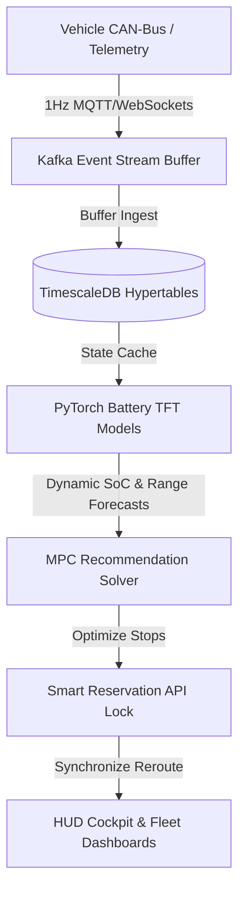

# EVIQ AI — The AI Operating System for EV Mobility Intelligence

[](https://github.com/eviq/eviq-ai/actions/workflows/verify.yml)
[](https://eviq.ai)
[](LICENSE)

EVIQ AI is the world's AI Operating System for EV Mobility Intelligence. We do not build charging maps, navigation apps, or charging networks. Instead, EVIQ AI serves as the intelligent decision overlay layer sitting above the global charging ecosystem.

---

## 🎯 Mission

**"Eliminate charging anxiety by predicting, explaining, and optimizing every EV charging decision."**

EVIQ AI integrates vehicle battery telemetry with live charging operator databases to transform electric mobility from a series of fragmented compromises into an optimized, predictable journey.

---

## ⚡ The Problem: The Charging Uncertainty Penalty

The transition to electric mobility is held back by charging anxiety and infrastructure unreliability:

- **Infrastructure Downtime**: Over 20% of public charging ports are offline or broken at any given moment.
- **Queue Congestion**: EV drivers frequently arrive at charging hubs to find long queues, wasting valuable time.
- **Battery Degradation**: Unoptimized charging habits and poor thermal management degrade expensive EV batteries prematurely.
- **Network Fragmentation**: Operating across dozens of incompatible charging networks prevents unified routing and booking.

---

## 🧠 The Solution

EVIQ AI answers **"Where SHOULD you charge, WHEN, WHY, and WHAT will happen to your battery if you do?"** It acts as an intelligent router and reservation gateway, predicting queues and locking booking slots before range anxiety arises.

---

## 🚀 Key Features

- **AI Mobility Copilot**: A natural language query interface parsing vehicle SoC levels and predicting safe range destinations.
- **Charging Intelligence Map**: Interactive maps tracing corridors with live queues, speeds, charger reliabilities, and amenities.
- **Reservation Console**: Book charger ports, lock off-peak tariffs, and sync routing configurations directly to vehicle HUD displays.
- **Journey Timeline**: High-fidelity progression mapping battery states, range predictions, slot locks, and battery health updates.
- **Critical Battery Autopilot**: Automatic activation below 20% (Planning Active), 10% (Critical Mode), and 5% (Emergency Mode) to lock safe charging ports automatically.

---

## 📸 Screenshots & Demonstrations

_Place screenshots in the `/assets` directory of your repository._

- **Landing Page**: `/assets/screenshot_landing.png`
- **AI Copilot**: `/assets/screenshot_copilot.png`
- **Charging Intelligence Map**: `/assets/screenshot_map.png`
- **Reservation Flow**: `/assets/screenshot_reservation.png`
- **Architecture Flow**: `/assets/screenshot_architecture.png`
- **Dashboard Viewport**: `/assets/screenshot_dashboard.png`

---

## 🗺️ Architecture Overview

EVIQ AI is built as a decoupled, event-driven decision pipeline:



1. **Telemetry Ingest**: Collects battery cell temperatures, voltages, and odometer feeds.
2. **Buffer Broker**: Buffers streams into partitioned hyper-tables.
3. **AI Predictors**: Forecasts remaining battery capacities under topographic or thermal stress.
4. **MPC Solver**: Optimizes stop coordinates evaluating chargers queues, pricing, and uptime.
5. **Actuator Gateway**: Locks reservations and pushes path updates directly to the in-car HUD.

---

## 🛠️ Technology Stack

- **Core**: Next.js 14 (App Router)
- **Styling**: Vanilla CSS (Tailwind CSS primitives)
- **Animations**: Framer Motion & HTML5 Canvas
- **Type Safety**: TypeScript 5.x
- **Development**: ESLint & Prettier

---

## 📂 Project Structure

```
eviq-ai/
├── app/                  # Next.js page routing, layouts, and styles
│   ├── demo/             # High-fidelity interactive competition MVP dashboard
│   ├── globals.css       # Core styling definitions
│   ├── layout.tsx        # HTML document frame
│   └── page.tsx          # Marketing landing page
├── components/           # UI and component modules
│   ├── architecture/     # Security and technical flow diagrams
│   ├── dashboard/        # Operational simulations and query terminals
│   ├── landing/          # Value proposition and marketing layouts
│   ├── layout/           # Headers, footers, and navigations
│   └── ui/               # Layout primitives (Container)
├── lib/                  # Shared helper scripts
├── types/                # TypeScript EV mobility data models
├── assets/               # Public images and screenshot assets
├── vercel.json           # Vercel routing configurations
└── tsconfig.json         # TypeScript configuration
```

---

## 📦 Getting Started

### 1. Prerequisites

Ensure you have **Node.js (v18.x or later)** and **npm** installed.

### 2. Installation

```bash
# Clone the repository
git clone https://github.com/eviq/eviq-ai.git

# Navigate to project directory
cd eviq-ai

# Install dependencies
npm install
```

### 3. Run Locally

```bash
npm run dev
```

Open [http://localhost:3000](http://localhost:3000) in your browser.

---

## 🧑‍💻 Development & Verifications

Always run verification checks before submitting Pull Requests:

```bash
# Run ESLint validation
npm run lint

# Run TypeScript type safety compilation
npm run typecheck

# Compile Next.js production build
npm run build
```

---

## 🗺️ Long-Term Roadmap

- **Phase 1 (Now)**: Consumer Charging Assistant & Trip Planner Sandbox.
- **Phase 2 (Q4 2025)**: Fleet Charging Scheduler & Optimization Platform.
- **Phase 3 (Q2 2026)**: Charging Network Operator OS & Queue Balancer.
- **Phase 4 (2026)**: Embedded Automotive OEM HUD Integration SDK.
- **Phase 5 (Long Term)**: Worldwide Smart Charging Grid Virtual Power Plant (VPP) Coordinator.

---

## 📄 License

This project is licensed under the MIT License - see the [LICENSE](LICENSE) file for details.

---

## 🤝 Contributing

Contributions are welcome! Please review [CONTRIBUTING.md](CONTRIBUTING.md) to understand linting and build standards.

---

## 📬 Contact

For pilots, API licensing, or investment inquiries, contact the founders at [Founder](mailto:2020sumoy@gmail.com).

---

## 💬 FAQ

### Is EVIQ AI a charging network or navigation map?

No. EVIQ AI is an intelligence overlay layer. We integrate with existing charging networks (such as ChargePoint, EVgo, Electrify America, Tesla Supercharger) and vehicle battery telemetry to provide predictions and reservation slot locks.

### How does EVIQ AI connect to vehicle telemetry?

EVIQ AI integrates with vehicle CAN-bus data networks via standard OBD-II dongles or direct automotive OEM APIs, streaming state-of-charge (SoC), thermal indexes, and cell voltages at 1Hz frequencies.

### How does EVIQ AI protect battery cell health?

The Battery Intelligence Engine evaluates dynamic charging curves against temperatures and cycle wears, optimizing charge profiles (e.g. capping supercharging sessions at 80% SoC when cells run hot) to prevent capacity loss.

### Can EVIQ AI lock charging reservations across different networks?

Yes, our Reservation Engine handles unified, cross-network API booking locks, allowing drivers to reserve ports across multiple networks in a single unified interface.
